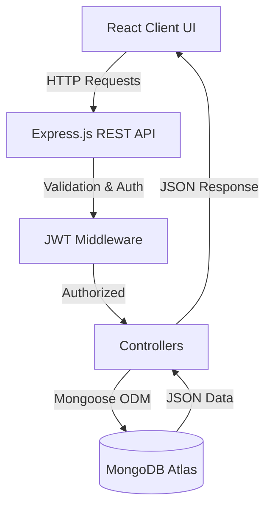

<div align="center">

  <h1>🚀 CRM Pro - Follow-up Management System</h1>
  <p><i>A modern, role-based CRM for managing leads, tracking follow-ups, and driving sales growth.</i></p>

  <p>
    
    
    
    
    
    
    <br />
    
    
    
  </p>
</div>

<details>
  <summary>Table of Contents</summary>
  <ol>
    <li><a href="#-project-overview">Project Overview</a></li>
    <li><a href="#-key-features">Key Features</a></li>
    <li><a href="#-tech-stack">Tech Stack</a></li>
    <li><a href="#-folder-structure">Folder Structure</a></li>
    <li><a href="#-system-architecture">System Architecture</a></li>
    <li><a href="#-api-modules">API Modules</a></li>
    <li><a href="#-installation-guide">Installation Guide</a></li>
    <li><a href="#-environment-variables">Environment Variables</a></li>
    <li><a href="#-deployment">Deployment</a></li>
    <li><a href="#-future-enhancements">Future Enhancements</a></li>
    <li><a href="#-author">Author</a></li>
    <li><a href="#-license">License</a></li>
  </ol>
</details>

---

## 📖 Project Overview

**What it does:** CRM Pro is a full-stack Customer Relationship Management application designed to track sales leads and manage subsequent follow-up interactions seamlessly.

**Why it was built:** Sales teams and freelancers often struggle to keep track of communication histories, pending tasks, and lead conversion rates across multiple spreadsheets. CRM Pro consolidates this into an intuitive visual platform.

**The problem it solves:** It eliminates dropped leads by providing scheduling for next-actions, centralizing communication notes, and enforcing organized progression through custom sales pipelines.

**Who can use it:** Sales representatives, account managers, freelancers, and small businesses looking for an accessible way to drive lead conversions.

---

## ✨ Key Features

- 🔐 **User Authentication (JWT):** Secure registration and login workflows with encrypted password hashing.
- 👥 **Role-Based Access Control:** Secure routes and APIs restricted to authorized users.
- 📇 **Lead Management:** Easily add, edit, track, and delete customer prospects.
- 📅 **Follow-up Tracking:** Schedule follow-ups, append interaction notes, and view chronological lead history.
- 📊 **Dashboard Analytics:** Visual charts monitoring lead growth, status breakdowns, and follow-up activity.
- 🔍 **Search & Filters:** Quickly locate leads via intelligent querying and table sorting.
- 🛡️ **Protected APIs:** Bulletproof backend utilizing authentication middleware to prevent data leaks.
- 🔄 **CRUD Operations:** Comprehensive data handling for dynamic content injection.
- 📱 **Responsive UI:** Fully mobile-optimized user interface designed with Tailwind CSS.
- ☁️ **Live Deployment:** Completely configured for seamless cloud hosting on Render.

---

## 💻 Tech Stack

| Category         | Technology                 |
| ---------------- | -------------------------- |
| **Frontend**     | React.js, Vite, Tailwind   |
| **Backend**      | Node.js                    |
| **Framework**    | Express.js                 |
| **Database**     | MongoDB (Mongoose)         |
| **Auth**         | JWT, bcryptjs              |
| **Deployment**   | Render                     |

---

## 📂 Folder Structure

```text
crm-project/
│
├── frontend/
│   ├── public/
│   ├── src/
│   │   ├── assets/
│   │   ├── components/
│   │   ├── pages/
│   │   ├── services/
│   │   ├── context/
│   │   ├── utils/
│   │   └── App.jsx
│   └── package.json
│
├── src/                 # Backend source
│   ├── config/          # DB connection
│   ├── controllers/     # Route logic
│   ├── middleware/      # Auth & error handling
│   ├── models/          # Mongoose schemas
│   ├── routes/          # Express routing
│   ├── app.js           # Express configuration
│   └── server.js        # Server entry point
│
├── .env.example
├── package.json
├── README.md
└── LICENSE
```

---

## 🏗 System Architecture



---

## 🔌 API Modules

| Module          | Functionality                               |
| --------------- | ------------------------------------------- |
| **Auth**        | Secure User Registration, Login, Sandbox    |
| **Leads**       | Full CRUD Operations for Customer Prospects |
| **Follow-ups**  | Schedule and Manage Interaction Timelines   |
| **Dashboard**   | Aggregate Chart Analytics & System Metrics  |
| **Users**       | Profile & Role Management                   |

---

## 🛠 Installation Guide

Follow these steps to run the project locally.

1. **Clone the repository:**
   ```bash
   git clone https://github.com/biyalizabraham08/CRM.git
   cd CRM
   ```

2. **Install dependencies:**
   *(Since this project is set up to deploy as a unified service, the root package.json handles both frontend and backend installs)*
   ```bash
   npm install
   npm run build
   ```

3. **Set up Environment Variables:**
   Rename `.env.example` to `.env` and fill in your credentials (see table below).

4. **Start the application:**
   ```bash
   npm run dev
   ```
   *The server will start on port 3000, and the Vite frontend will run on 5173.*

---

## ⚙️ Environment Variables

| Variable       | Description                                  |
| -------------- | -------------------------------------------- |
| `PORT`         | Server Port (e.g., 3000)                     |
| `MONGO_URI`    | MongoDB Atlas Connection String              |
| `JWT_SECRET`   | Cryptographic key for signing Auth Tokens    |
| `NODE_ENV`     | Deployment environment (e.g., `production`)  |

---


## 🚀 Deployment

The project is structured for a zero-config deployment on **Render** utilizing a unified build process.

**Frontend & Backend Deployment:**
1. Connect your GitHub repository to Render as a **Web Service**.
2. **Build Command:** `npm run build`
3. **Start Command:** `npm start`
4. Set the necessary Environment Variables inside the Render dashboard.

The Node.js server will automatically handle serving the static compiled React UI from the `/dist` folder.

---

## 🔮 Future Enhancements

- 📧 **Email Notifications:** Automated reminders for scheduled follow-ups via SendGrid.
- 💬 **WhatsApp Integration:** Direct client messaging utilizing Twilio APIs.
- 🤖 **AI Lead Scoring:** Machine learning model to predict lead conversion probabilities.
- 👥 **Team Collaboration:** Multi-tenant architecture for assigning leads to team members.
- 📱 **Mobile App:** React Native wrapper for on-the-go CRM access.

---

## 👨‍💻 Author

<div align="center">
  <h3>Biyaliz Abraham</h3>
  <p>Full-Stack Developer</p>
</div>

---

## 📜 License

This project is licensed under the **MIT License**.
See the [LICENSE](LICENSE) file for more information.

<div align="center">
  <p>Built with ❤️ by Biyaliz</p>
</div>
